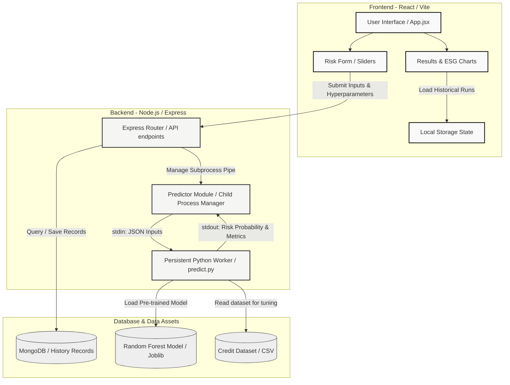

# Aetheris Risk

Aetheris Risk is an intelligent, real-time credit risk assessment application that integrates traditional credit analytics with country-level Environmental, Social, and Governance (ESG) sustainability metrics.

The system allows credit underwriters and analysts to evaluate risk profiles, adjust model hyperparameters dynamically, and inspect performance benchmarks.

---

## Architecture and System Design



---

## Key Features

- **Hybrid Credit & ESG Scoring**: Combines borrower credit parameters with country-level ESG factors to produce a composite sustainability-adjusted risk label.
- **Dynamic Hyperparameter Tuning**: Allows on-the-fly model retraining (Trees, Max Depth, Min Samples Split) directly from the user interface.
- **Persistent Python Predictor**: Utilizes a persistent child process worker communication architecture to bypass cold-start imports and execute model predictions in ~30–150 ms.
- **Historical Run Benchmarking**: Tracks and compares model iterations with an active evaluation card showing validation metrics (AUC, Accuracy, Training latency).

---

## Getting Started

### Prerequisites

- Node.js (v18+)
- Python (v3.10+) with pip

### Installation

1. **Clone the repository**:
   ```bash
   git clone https://github.com/Vaibhav-S-Gowda/Aetheris-Risk.git
   cd Aetheris-Risk
   ```

2. **Backend Setup**:
   ```bash
   cd server
   npm install
   # Ensure required Python libraries are installed
   pip install scikit-learn joblib numpy pandas
   ```

3. **Frontend Setup**:
   ```bash
   cd ../client
   npm install
   ```

### Running Locally

1. **Start the Backend Server**:
   ```bash
   cd server
   node index.js
   ```
   *The server runs on `http://localhost:5000`.*

2. **Start the Frontend Development Server**:
   ```bash
   cd client
   npm run dev
   ```
   *The development app runs on `http://localhost:5173`.*

---

## Deployment Configuration

### Backend (Render)
- **Root Directory**: `server`
- **Build Command**: `npm install && pip install scikit-learn joblib numpy pandas`
- **Start Command**: `node index.js`
- **Required Environment Variables**: 
  - `MONGO_URI` (Optional: MongoDB database connection string)
  - `CLIENT_ORIGIN` (Vercel deployment URL)

### Frontend (Vercel)
- **Build Command**: `npm run build`
- **Output Directory**: `dist`
- **Framework Preset**: `Vite`
